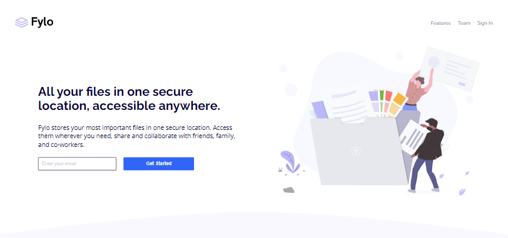

# Fylo landing page

## Conteúdo
- [Sobre](#sobre)
- [Link](#link)
- [Tecnologias](#tecnologias)
- [Autor](#autor)

## Sobre
Esta é uma solução para o desafio da Fylo landing page no Frontend Mentor, responsivo para grande parte dos dispositivos. A landing page é sobre um local de armazenamento seguro, colaborativo com amigos, familiares e colegas de trabalho.

## Link
- Site - https://landingpage-fylo.netlify.app

## Tecnologias
- HTML
- CSS

## Autor
- Site - https://sanches-spoladore.netlify.app
- Perfil no Frontend Mentor - https://www.frontendmentor.io/profile/sanchesspoladore