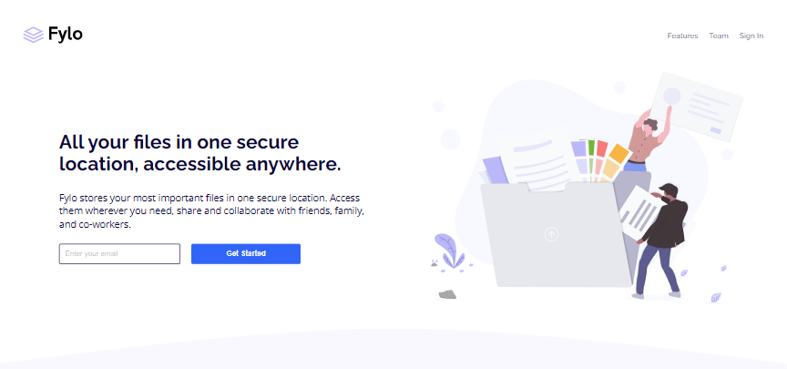

# # Fylo landing page

## Conteúdo
- [Sobre](#sobre)
- [Links](#link)
- [Tecnologias](#tecnologias)
- [Autor](#autor)

## Sobre
Esta é uma solução para o [desafio da Fylo landing page no Frontend Mentor](https://www.frontendmentor.io/challenges/fylo-landing-page-with-two-column-layout-5ca5ef041e82137ec91a50f5), responsivo para grande parte dos dispositivos. A landing page é sobre um local de armazenamento seguro, colaborativo com amigos, familiares e colegas de trabalho.

## Link
- Site - https://landingpage-fylo.netlify.app

## Tecnologias
- Tags semânticas do HTML5
- Propriedades comuns do CSS
- Flexbox

## Autor
Perfil no Frontend Mentor - https://www.frontendmentor.io/profile/sanchesspoladore